## Familles de nombres
### Nombres naturels, N ou ℕ

nombres entiers positifs utilisés pour compter

- Ils commencent à 1 (ou parfois à 0 selon la définition) et continuent à l'infini : 1, 2, 3, 4, 5, ...
- Ils n'incluent pas de fractions, de décimales ou de nombres négatifs.
- Ils sont utilisés pour compter des objets discrets

### Nombres réels, $R$

- Tous les nombres naturels
- Les nombres entiers négatifs
- Les nombres rationnels (fractions)
- Les nombres irrationnels (comme π ou √2)

Les nombres réels représentent tous les points sur une ligne numérique continue. Ils peuvent être positifs, négatifs ou nuls, et inclure une infinité de décimales.

### Principales différences entre réels et naturels

- Les naturels sont discrets, les réels sont continus.
- Les naturels sont dénombrables, les réels sont non-dénombrables (il y a "plus" de réels que de naturels).
- Les naturels sont un sous-ensemble des réels.
- Les réels permettent des opérations plus complexes comme les racines carrées de nombres négatifs.

En résumé, les nombres naturels sont utilisés pour compter, tandis que les nombres réels représentent toutes les valeurs possibles sur une ligne numérique continue.

## cercle trigonométrie

- rayon 1
- centrée sur l'origine d'un repère orthonormé
- cosinus sur l'axe x, sinus sur l'axe y

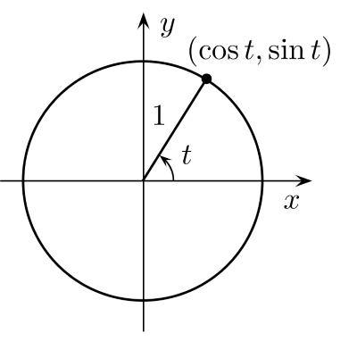

permet d'illustrer et de définir des notions comme celles d'angle, de radian
et les **fonction trigonométriques** : cosinus, sinus, tangente.

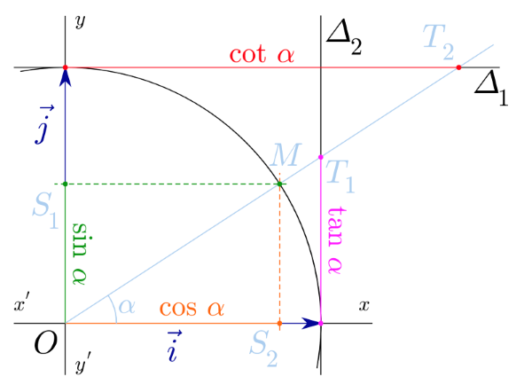

### vecteur
vecteurs de base :
- forment le repère
- chacun suit un axe, sa taille correspond a l'unité de cet axe :
	- $\vec{i}$  pour les abscisse
	- $\vec{j}$  pour les ordonnées
- permettent d'obtenir les coordonnées d'un vecteur

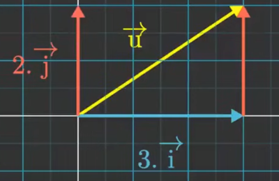

Les coordonnées  d'un vecteur se notent verticalement :

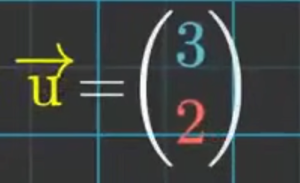
Addition de vecteur = addition de leur coordonnée respectives
multiplication des coordonnée d'un vecteur par un nombre = multiplication de chacune des coordonnées par ce nombre

## Statistiques, probabilités

**mesures de tendance centrale** et de **dispersion** en **statistiques descriptives**.

### Médiane
Le point milieu d'un jeu de données 
50 % des unités ont une valeur inférieure ou égale à la médiane 
50 % des unités ont une valeur supérieure ou égale à la médiane 

|                            |                                                     |       |
| -------------------------- | --------------------------------------------------- | ----- |
| **Ecart-type    $\sigma$** | $\sqrt{\text{variance}}$                            | sigma |
| **variance**               | moyenne des ( écarts par rapport à la moyenne )$^2$ |       |

###  Étendue  $= X_{\max} - X_{\min}$

– Mesure la distance entre la plus grande et la plus petite valeur.  
– C’est simple et rapide pour avoir une idée du "span" des données.

– Très sensible aux valeurs extrêmes (outliers).  
– Ne dit rien sur la distribution des autres valeurs.

---

###  Variance :

$${Var}(X) = \frac{1}{n} \sum_{i=1}^{n} (X_i - \bar{X})^2 $$

– Mesure la dispersion moyenne des valeurs autour de la moyenne.  
– Chaque écart est mis au carré pour éviter que les écarts positifs et négatifs ne s'annulent.

Si on travaille sur un **échantillon**, on divise par $n - 1$ au lieu de $n$ :

$$ {Var}(X) = \frac{1}{n - 1} \sum_{i=1}^{n} (X_i - \bar{X})^2 $$
---
### Écart-type :

$$\sigma_X = \sqrt{{Var}(X)}$$

La racine carrée de la variance : il s’exprime dans la même unité que les données (contrairement à la variance).

|Mesure|Cas d’usage|Sensibilité aux valeurs extrêmes|
|---|---|---|
|Étendue|Repérer rapidement l’amplitude des données|Très sensible|
|Variance / écart-type|Étudier la dispersion globale (utile en statistique, modélisation)|Sensible, mais moins qu’une simple étendue|

---

| Terme            | Définition courte                                                                                                                       |
| ---------------- | --------------------------------------------------------------------------------------------------------------------------------------- |
| **Centrer**      | Soustraire la **moyenne** → valeurs réparties autour de 0                                                                               |
| **Réduire**      | Diviser par l’**écart-type** → met toutes les variables sur une échelle comparable                                                      |
| **Standardiser** | **Centrer + Réduire** → moyenne = 0, écart-type = 1                                                                                     |
| **Normaliser**   | **Ramener dans un intervalle fixe** (souvent $0,1$) → met toutes les valeurs à la même échelle sans changer la forme de la distribution |

### Normaliser les données

`Min-Max scaling`
Pour que les valeurs soient comprises dans un intervalle  souvent $0$ et $1$

$$ X_\text{normalisé} = \frac {X - X_\text{min}} {X_\text{max} - X_\text{min}} $$

​
- Utile quand les variables ont des unités très différentes.

- Recommandé pour les algorithmes sensibles aux amplitudes brutes (réseaux de neurones, distances euclidiennes...).

- Ne change pas la forme de la distribution, juste l’échelle.

### centrer les données

Répartit les données autour de zéro.

Pour chaque variable : soustrait la moyenne de la variable à chaque observation

$$ 𝑥_\text{centré} = x - \bar x $$
 

Après centrage, la moyenne $\mu =0$.

Cela ne change pas l'écart-type (la dispersion), donc ne modifie pas le nuage de points, seulement la position de la variable sur l’axe des valeurs.

### Réduire les données
Réduire l’écart-type à 1
Diviser chaque variable centrée par son écart-type $\sigma$
Se fait souvent après le centrage :

$$ 𝑥_\text{réduit} = \frac{x - \bar x}{\sigma} $$

- toutes les variables sur la même échelle, avec la même importance
- évite qu’une variable avec des grandes valeurs domine les autres
- comparer les valeurs prises par les variables exprimées dans des unités différentes
- indispensable si les unité de mesure sont différentes d'une variable à l'autre

- Ne pas réduire donne plus d'importance aux variables qui on une variance plus grande

### Centrer et réduire = Standardiser

| Aspect      | Standardisation               | Normalisation                              |
| ----------- | ----------------------------- | ------------------------------------------ |
| Formule     | $\frac{X - \mu}{\sigma}$      | $\frac{X - X_{\min}}{X_{\max} - X_{\min}}$ |
| Résultat    | Moyenne = 0, Écart-type = 1   | Valeurs entre 0 et 1 (ou autre)            |
| Sensibilité | Moins sensible aux outliers   | Très sensible aux outliers                 |
| Utilisation | PCA, K-Means, SVM, Régression | Réseaux de neurones, distances             |

Utile quand :
- Les données suivent une distribution gaussienne (ou presque).

- Les algorithmes sont basés sur la distance ou les coefficients (régression linéaire, K-means, PCA

### Dérivée

**Dérivation** : étude des variations en un point
Comme cela n'as pas de sens d'étudier les variation sur un point.
Soit une courbe qui représente un déplacement, temps en abscisse, distance en ordonnée
#### Dérivé selon Leibniz

On veut signifier un changement infiniment petit d'une quantité t :
un tout petit peu plus de t = dt (notation de Leibnitz)
un tout petit peu plus de f = df

La pente de la séquence au point d'abscisse 1 vaut $\frac{df}{dt}_{(1)}$ :
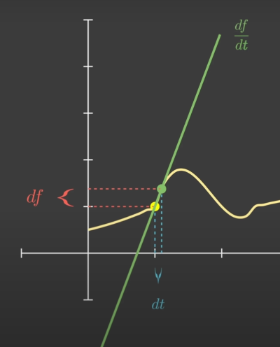

Quand on zoom suffisament sur une courbe, elle devient une droite

Soit un point B infiniment proche de A, la sequente AB est confondu avec la courbe, c'est une tangente
La courbe et la tangente sont confondue sur un intervalle infiniment petit autour de A.
elles ont donc les mêmes variations

la variation d'une droite dépend du signe de son coefficient directeur :
coefficient directeur > 0 : droite croissante
coefficient directeur < 0 : droite décroissante

### le gradient

Le gradient $\frac{∂𝐿}{∂w}$​ mesure la pente de la fonction coût par rapport à $𝑤$

👉 C’est la variation de la fonction coût (par exemple log loss (en ordonnée) quand le paramètre $w$ (en abscisse) varie légèrement

- Si $\frac{∂𝐿}{∂w} > 0$ la pente est positive → la fonction coût augmente quand 
$𝑤$ augmente.

- Si $\frac{∂𝐿}{∂w} < 0$ la pente est négative → la fonction coût diminue quand $𝑤$ augmente

### Desente de gradient
En machine learning, dans l’apprentissage (gradient descent), on ajuste $𝑤$ dans le sens opposé au gradient :
$$ 𝑤 = 𝑤−𝛼\frac{∂𝐿}{∂w} $$

$\alpha$ est  un tout petit positif, cela diminue petit à petit le paramètre $w$ pour aller vers un minimum de la courbe $L(w)$

| Axe              | Contenu                | Interprétation           |
| ---------------- | ---------------------- | ------------------------ |
| **x (abscisse)** | le **poids (w)**       | variable du modèle       |
| **y (ordonnée)** | la **log loss (L(w))** | erreur moyenne du modèle |

## opérations
- addition
- soustraction
- multiplication
- division
- convolution

## Identités remarquables :
#### 1. Carré d'une somme
$$
(a + b)^2 = a^2 + 2ab + b^2
$$
#### 2. Carré d'une différence
$$
(a - b)^2 = a^2 - 2ab + b^2
$$
#### 3. Produit d'une somme et d'une différence
$$
(a + b)(a - b) = a^2 - b^2
$$

## Polynôme

### équation du 1er degré
équation linéaire, où la variable est élevée à la puissance 1. Elle prend généralement la forme suivante :$$ax+b=0$$où a et b sont des constantes, avec $$a≠0$$Cette équation a une seule solution.

### équation du 2nd degré
ou équation quadratique, la variable est élevée à la puissance 2. Elle prend la forme suivante :$$ax2+bx+c=0$$
où a, b, et c sont des constantes, et $$a≠0$$Elle peut avoir deux solutions, une seule solution, ou aucune solution réelle (dans le cas où le discriminant est négatif).

https://www.youtube.com/watch?v=lQxJhGg2GQY

- Le coefficient apermet de savoir dans quel sens sont tournées les branches de la parabole
- La forme factorisé donne l'intersection avec l'axe des abscisses ainsi que les racines de l'équation f(x) = 0
- La forme canonique donne les coordonnées de l'extremum (le sommet), Beta = ordonnée, et alpha = abscisse

### équation du 3ème degré
équation cubique, où la variable est élevée à la puissance 3. Elle prend la forme :
$$ax3+bx2+cx+d=0$$

où a, b, c, et d sont des constantes, avec $$a≠0$$A toujours au moins une solution réelle et peut avoir jusqu’à trois solutions réelles (ou une combinaison de solutions réelles et complexes).

**Polynome du second dégré**
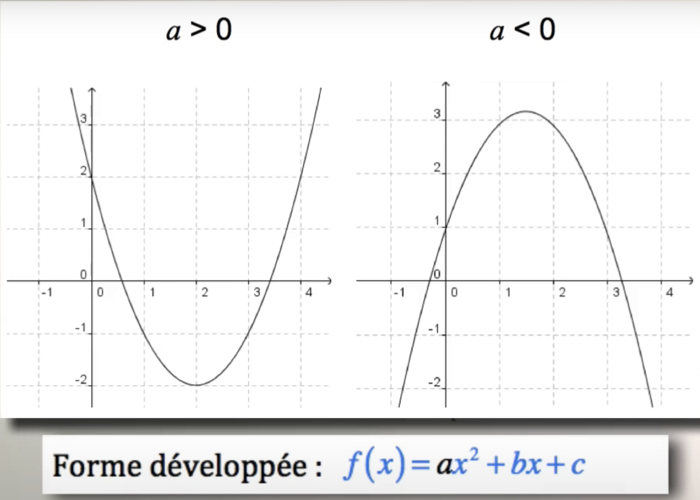

## formes canonique / développée / factorisée

Soit le polynôme de degré 2 :
$$
f(x) = ax^2 + bx + c
$$

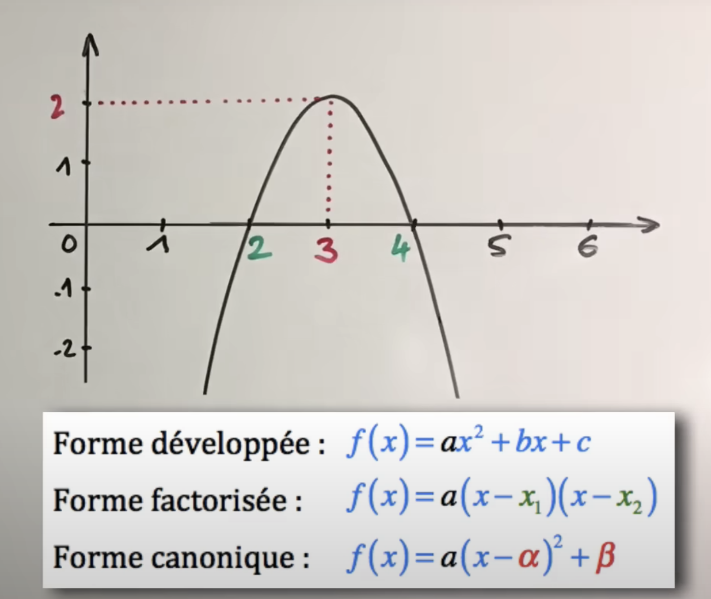

Sa forme canonique est donnée par :
$$
f(x)=a(x−h)^2+k
$$
où :

- h et k sont les coordonnées du **sommet** de la parabole représentée par f(x)
- $$h=−\frac{b}{2a},$$
- $$k = f(h) = c - \frac{b^2}{4a}​.$$
Ces différentes formes sont utiles pour différentes analyses du polynôme, comme l'étude de ses variations, la détermination de ses racines, ou la visualisation de sa représentation graphique
### La forme canonique
d'un polynôme de degré 2

est une manière de le réécrire pour mettre en évidence son sommet, ce qui est particulièrement utile pour étudier la courbe représentative du polynôme (parabole) et pour déterminer ses coordonnées du sommet.

s'écrit : $f(x)=a(x−α)2+β$ où :

- $a$ est le coefficient du terme de degré 2
- $α$ est l'abscisse du sommet de la parabole
- $β$ est l'ordonnée du sommet de la parabole

On peut obtenir $α$ et $β$ à partir de la forme développée $f(x)=ax2+bx+c$ :
$α=−b/2a$
  
$β=−Δ/4a = −(b2−4ac)/4a$

### La forme développée
d'un polynôme de degré 2

est l'écriture standard sous la forme :
$f(x)=ax2+bx+c$
où $a$, $b$, et $c$ sont des réels et $a≠0$

### La forme factorisée
d'un polynôme de degré 2

n'est possible que si le polynôme admet des racines réelles.
Elle s'écrit :
$f(x)=a(x−x1)(x−x2)$
où $x1$​ et $x2$ sont les racines du polynôme.

Si le polynôme n'admet qu'une racine double, la forme factorisée s'écrit :
$f(x)=a(x−x0)2$
où $x0$​ est la racine double.

## Logarithmes
sont la réciproque des exponenetielles

La forme générale de la courbe logarithmique est la même pour toutes les bases :

- passe par le point (1,0)
- est croissante
- est très pentue pour les petits $𝑥$
- s’aplatit quand $𝑥$ devient grand

| Base | Fonction           | Effet sur la courbe       |
| ---- | ------------------ | ------------------------- |
| 2    | $y = \log_2(x)$    | Monte plus **rapidement** |
| 10   | $y = \log_{10}(x)$ | Monte plus **doucement**  |
| e    | $y = \ln(x)$       | Entre les deux            |

À quelle puissance faut-il élever la base $𝑏$ pour obtenir $y = 𝑥$ ? 
Le logarithme $log_𝑏(𝑥)$ donne l’exposant $𝑦$ tel que $𝑏^𝑦 = 𝑥$
$$log_𝑏(𝑥) = y \quad \Longleftrightarrow \quad b^y=x$$

🔹 Exemples : $log_{10}(10)$ 

Base : $b = 10$ 
Nombre : $x = 10$ 
On cherche $𝑦$ tel que  $10^y = 10 \quad$ ⇒ $\quad 𝑦 = 1$ $\quad$ ⇒ $\quad log_{10}(10) = 1$

$100 = 10^2$ →  $log (100) = 2$  
$1000 = 10^3$  →  $log (1000) = 3$ 
etc..

🔹 Exemples : $log_{2}(8)$ 

Base : $b = 2$ 
Nombre : $x = 8$ 
On cherche $𝑦$ tel que  $2^y = 8 \quad ⇒ \quad2^3=8$ ⇒ $\quad 𝑦 = 3$ $\quad$ ⇒ $\quad log_{2}(8) = 3$ 

$(2*2*2=8)$

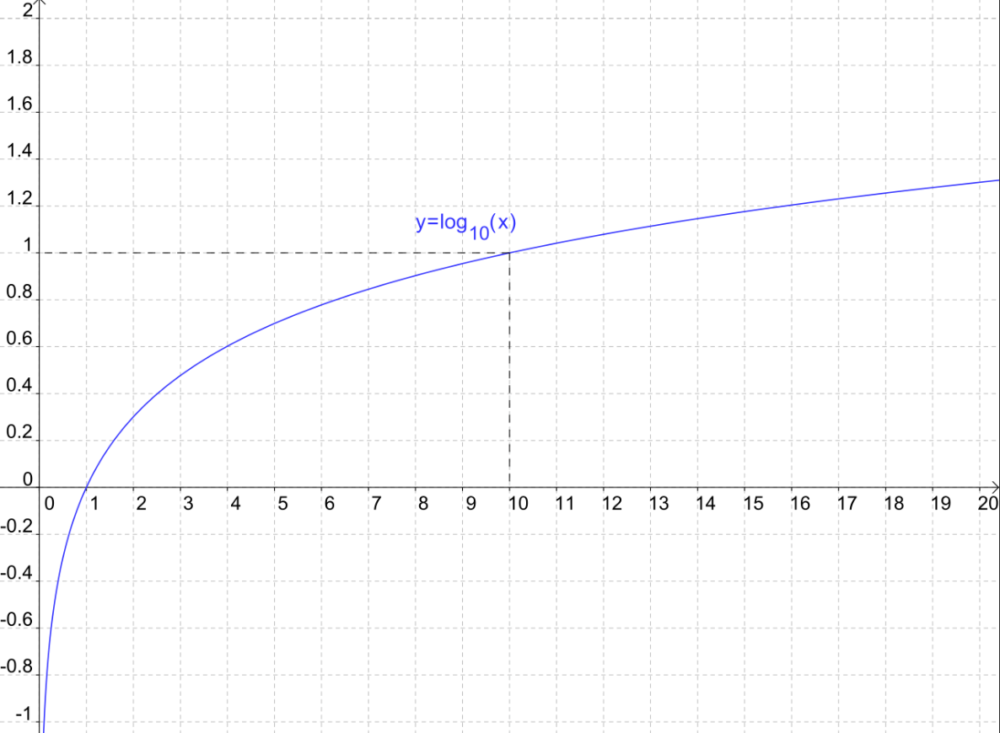

### Logarithme en base 10

| Expression           | Question                                              | Equivalent | Résultats               |
| -------------------- | ----------------------------------------------------- | ---------- | ----------------------- |
| $$\log_{10} 100 $$   | combien de 10 multiplier entre eux pour obtenir 100   | $$10^2 = 100$$   | $$\log_{10} 100 =2$$    |
| $$\log_{10} 1000$$   | combien de 10 multiplier entre eux pour obtenir 1000  | $$10^3 = 1000$$   | $$\log_{10} 1000 = 3 $$ |
| $$\log_{10} 10 000$$ | combien de 10 multiplier entre eux pour obtenir 10000 | $$10^4 = 10000$$   | $$\log_{10} 10000 = 4$$   |

### Logarithme en base 2

| $$\log_{2} 8 $$ | combien de 2 multiplier entre eux pour obtenir 8  | $$10^2$$ | $$\log_{2} 8 = 3$$  |
| --------------- | ------------------------------------------------- | -------- | ------------------- |
| $$\log_{2} 16$$ | combien de 2 multiplier entre eux pour obtenir 16 | $$10^3$$ | $$\log_{2} 16 = 4$$ |
| $$\log_{2} 32$$ | combien de 2 multiplier entre eux pour obtenir 32 | $$10^4$$ | $$\log_{2} 32 = 5$$ |

**Les tables de logarithme** simplifient la multiplication de grand nombres en les transformant en addition 
**pour multiplier 2 chiffre, il faut additionner leur logarithmes** :
**log(988 452x659 233) = log(988 452) + log(659 233))**
 

### logarithme naturel ou népérien
 C’est le logarithme dont la base est $𝑒≈2.71828$ 
$e$ étant le nombre d’Euler

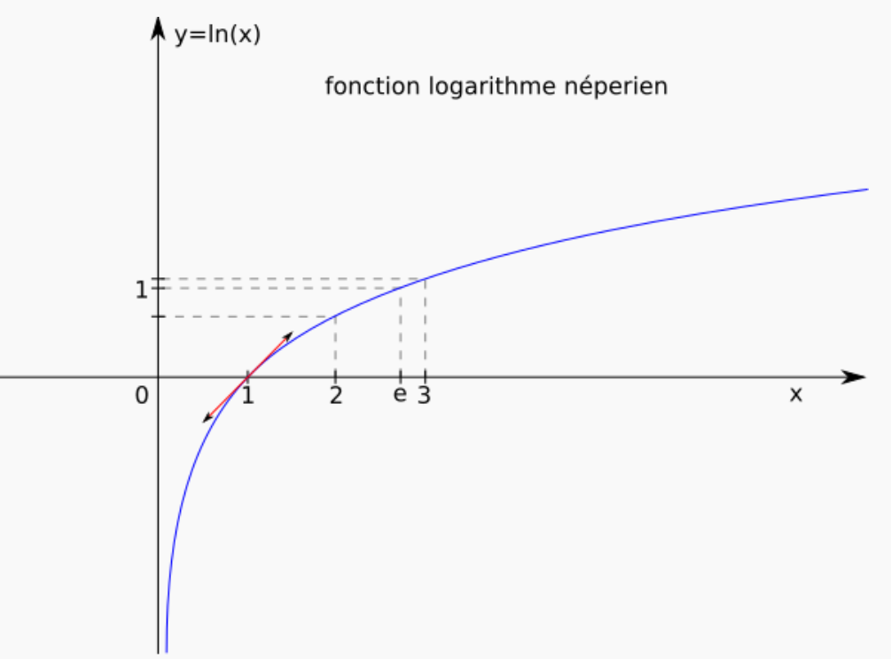

notation standard en mathématiques : $ln(𝑥)$ 
notation internationale et en machine learning : $log$

utilisé par la fonction **logit**
### racine / exposant
$2^2 = 4$

| au carré       | exposant $^2$      |
| -------------- | ------------------ |
| racine carré   | exposant $^{0.5}$  |
| racine cubique | exposant $^{0.33}$ |

### autres

transformé de fourrier
concept de corrélation

$\sigma$ (sigma) = écart type

phénomène aléatoire

---
### Loi Normale ou Gaussienne

La loi normale, ou loi de Gauss (du nom de son créateur), est une distribution de probabilité symétrique centrée autour de la moyenne $\mu$.  
Sa médiane est égale à sa moyenne.

Une **distribution normale** est définie par deux paramètres :

- **Moyenne $\mu$** : le centre de la distribution.
- **Écart-type $\sigma$** : la dispersion des valeurs autour de la moyenne.

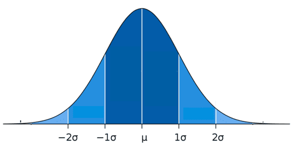

Elle est notée : 

$\boxed{X∼N(μ,σ2)}$  c'est à dire $X$ suit une loi normale de moyenne $\mu$ et de variance $\sigma^2$.

L’aire compris entre -1,96 σ et +1,96 σ autour de la moyenne représente 95% de l’aire totale sous la courbe.

La taille des individus suit généralement une loi normale avec :
- μ = 170 cm
- σ = 10 cm

Cette propriété permet notamment de **filtrer le bruit** :  
Si l'on répète une mesure un grand nombre de fois, les variations aléatoires (positives ou négatives) finissent par s'annuler lorsque l'on calcule la moyenne.

Si une variable suit une **distribution normale** ou **gaussienne**:
- Courbe en cloche dont la forme dépend de $\mu$ et  $\sigma$
- La règle des 68-95-99,7 s'applique 

|                                         | $\sigma = \text{écart-type}$                                               |
| --------------------------------------- | -------------------------------------------------------------------------- |
| $\approx$ 68 % des valeurs   | se situent à moins de  $\sigma$ de la moyenne               |
| $\approx$ 95 % des valeurs   | se situent à moins de 2 $\sigma$ de la moyenne              |
| $\approx$ 99,7 % des valeurs | se situent à moins de 3 $\sigma$ de la moyenne              |
|                                         | 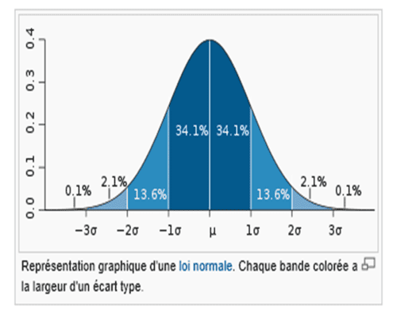 |

## Loi Normale Centrée Réduite

**Une loi normale centrée réduite est une loi normale qui a été transformée pour avoir
- une moyenne µ = 0 
- un écart-type σ = 1

Cela permet d’uniformiser les données et de faciliter les comparaisons et les calculs statistiques.
On peut comparer différentes distributions normales sans être affecté par leur moyenne et leur écart-type.

Elle est obtenue en transformant une variable $\boxed{X∼N(μ,σ2)}$  (Loi normale)
En une **nouvelle variable** $Z$
Qui suit une distribution normale centrée réduite : $\boxed{Z = \dfrac{X - \mu}{\sigma}}$

Cette transformation garantit que **la nouvelle variable $Z$ suit une loi normale avec : $\boxed{Z \sim \mathcal{N}(0, 1)}$

C’est-à-dire une moyenne 0 et un écart-type 1

|                     | Distribution normale                             | Distribution normale centrée réduite                                  |
| ------------------- | ------------------------------------------------ | --------------------------------------------------------------------- |
| Moyenne $\mu$       | Peut être n'importe quelle valeur                | Toujours 0                                                            |
| Écart-type $\sigma$ | Peut être n'importe quelle valeur                | Toujours 1                                                            |
| Notation            | $X \sim \mathcal{N}(\mu, \sigma^2)$              | $Z \sim \mathcal{N}(0,1)$                                             |

---

## Dérivée partielle

Dérivéé partielle de $J$ par rapport au paramètre $a$ : $\frac{\partial J}{\partial a}$
 
