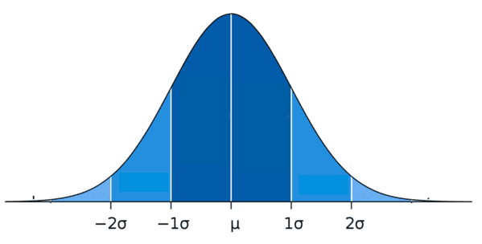
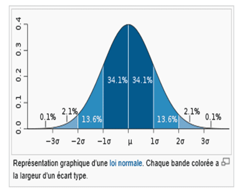

<h2>Statistiques descriptives</h>

- Mesure de tendance centrale
	- moyenne arythmétique
	- moyenne géométrique
	- moyenne harmonique
	- moyenne quadratique
	- médiane
	- mode
- Mesure de dispersion
- Distribution

<h3>Mesure de tendance centrale</h3>

### moyenne arythmétique `np.mean`
Somme des valeurs divisée par leur nombre 
Donne le centre des données mais tres sensible au valeurs extrêmes
#### moyenne géométrique `scipy.stats.gmean(variable)`
moyenne multiplicative 
robuste aux valeurs extrêmes 
non définie pour les valrurs négztives ou nulles
conseillées pour les données qui varient de manère multiplicative
#### moyenne harmonique `scipy.stats.hmean(variable)`
moyenne des inverses 
très sensible aux faibles valeurs 
conseillées pour les taux et ratios 
tres influencé par les valeurs proches de zéro
#### moyenne quadratique `np.sqrt(np.mean(np.square(variable)))`
moyenne des carrés 
utile pour l'analyse de variance
conseillées pour les données qui concernent l'énergie, la puissance
sensible aux valeur extremes

### Médiane
`np.median(variable)` 
`df['column'].median()` 
Le point milieu d'un jeu de données 
si le nombre de données est apir, ilfaut faire la moyenne des 2 valeurs centrales 
50 % des unités ont une valeur inférieure ou égale à la médiane
50 % des unités ont une valeur supérieure ou égale**
robuste aux valeurs extrêmes

### Mode `modes = df['column'].mode().tolist()`
valeur la plus présente 
s'applique aux variables numériques et catégorielles

<h3>Mesure de la dispersion</h3>

###  Étendue  $= X_{\max} - X_{\min}$ `np.ptp(data)`

numpy fonction peaktopeak `np.ptp()`
– Mesure la distance entre la plus grande et la plus petite valeur 
– C’est simple et rapide pour avoir une idée du "span" des données 
– Très sensible aux valeurs extrêmes (outliers) 
– Ne dit rien sur la distribution des autres valeurs

---

### Quartile, écart interquartile, bornes
Le Quartile divise les données en 4 parties égales :
- Q1 valeur en dessous de laquelle se trouve 25 % des données
- Q2 est la médiane qui divise les données en 2
- Q3 valeur au dessus de laquelle se trouve 25 % des données
- Q3 - Q1 = écart interquartile contient 50 % des valeurs d'un jeu de données
- bornes inf et supérieur : au dela, les valeurs sont considérées come des outliers
- bornes inférieure = Q1 - 1,5 écart interquartile
- bornes supérieure = Q1 - 1,5 écart interquartile

|     Quartile / IQR   |     Numpy             |    Pandas   |
| -------------------- | --------------------- | ----------- |
| Q1   | `q1 = np.percentile(data, 25)`    | `series.quantiles(0,25)` |
| Q3   | `q2 = np.percentile(data, 75)`   |  `series.quantiles(0,75)` |
| IQR | `iqr = q3 - q1`  |  |
| Borne inférieure   | `q1 - 1.5*iqr`   |   |
| Borne supérieure   | `q3 + 1.5*iqr`   |   |

---

###  Variance :

Mesure quantitative de la dispersion des valeurs autour de la moyenne :
1. calculer la moyenne des données
2. soustraire la moyenn à chaque valeur pour obtenir les écarts
3. élever chaque écarts au carré
4. calculer la moyenne des carrés
$${Var}(X) = \frac{1}{n} \sum_{i=1}^{n} (X_i - \bar{X})^2$$

Plus la variance est éleve, plusles données sont dispersées, et inversement
– sensible aux valeurs aberrentes  
– Chaque écart est mis au carré pour éviter que les écarts positifs et négatifs ne s'annulent 
l'interprétation est donc difficile car exprimée en unité au carré

### Variance, Correction de Bessel `ddof=0 ddof=1`
On travaille généralement sur un échantillon, pas sur la population 
Si on travaille sur une **population**, on divise par **$n$** 
Si on travaille sur un **échantillon**, on divise par **$n - 1$** 
ça corrige le biais de l'estimation

$${Var}(X) = \frac{1}{n - 1} \sum_{i=1}^{n} (X_i - \bar{X})^2$$

|                       |             population       |    échantillon   |
| -------------------------- | --------------------------------------------------- | ----- |
| **Numpy**   | `var = np.var(data, ddof=0)`      | `var = np.var(data, ddof=1)`        |
| **Pandas** | `var = df.['column'].var(ddof=0)`  |  `var = df.['column'].var(ddof=1)`  |
| **Statistics** | `var = statistics.pvariance(data)` |`var = statistics.variance(data)`|

---
### Écart-type :
La racine carrée de la variance 
s’exprime dans la même unité que les données (contrairement à la variance)
- moins sensible aux outliers
$$\sigma_X = \sqrt{{Var}(X)}$$

|                       |             population       |    échantillon   | Par défaut|
| -------------------------- | --------------------------------------------------- | ----- | ---|
| **Numpy**   | `std = np.std(data, ddof=0)`      | `std = np.std(data, ddof=1)`        | `ddof=0`|
| **Pandas** | `std = df.['column'].std(ddof=0)`  |  `std = df.['column'].std(ddof=1)`  | `ddof=1`|
| **Statistics** | `std = statistics.pstdev(data)` |`std = statistics.stdev(data)`| |

### Différences  entre écart type et variance

|                            |                                                     |       |
| -------------------------- | --------------------------------------------------- | ----- |
| **Ecart-type    $\sigma$** | $\sqrt{\text{variance}}$                            | sigma |
| **variance**               | moyenne des ( écarts par rapport à la moyenne )$^2$ |       |

|Mesure|Cas d’usage|Sensibilité aux valeurs extrêmes|
|---|---|---|
|Étendue|Repérer rapidement l’amplitude des données|Très sensible|
|Variance / écart-type|Étudier la dispersion globale (utile en statistique, modélisation)|Sensible, mais moins qu’une simple étendue|

<h3>Distribution</h3>

Décrit la manière dont les valeurs d'une variable sont répartie 
 
l'étude de la  distribution permet de :
- chiffre la probabilité qu'une valeur se situe dans une certaine plage
- éterminer si la distribution se rapproche d'une distribution théorique connue
- identifier les caractéristiques des valeur extrêmes ou aberrantes 

### Distribution normale

Différentes appélation : 
- loi normale, fréquement observées dans les phénomènes naturels ou sociaux
- loi de Gauss ou Gaussienne, du nom de son créateur
- courbe de Gauss
- courbe en cloche

La majorité des valeurs sont autour de la moyenne, leur fréquence baisse au fur et à mesure qu'on s'en éloigne de part et d'autre.

- **Distribution de probabilité symétrique** : centrée autour de la moyenne $\mu$
- **Egalité des indicateurs de tendance centrale** : médiane = moyenne = normale

- **regle des 68_95_99 :** 

|                                         | $\sigma = \text{écart-type}$                                               |
| --------------------------------------- | -------------------------------------------------------------------------- |
| $\approx$ 68 % des valeurs   | se situent à moins de  $\sigma$ de la moyenne               |
| $\approx$ 95 % des valeurs   | se situent à moins de 2 $\sigma$ de la moyenne              |
| $\approx$ 99,7 % des valeurs | se situent à moins de 3 $\sigma$ de la moyenne              |

 

Elle est notée : 

$\boxed{X∼N(μ,σ2)}$  c'est à dire $X$ suit une loi normale de moyenne $\mu$ et de variance $\sigma^2$.

L’aire compris entre -1,96 σ et +1,96 σ autour de la moyenne représente 95% de l’aire totale sous la courbe.

La taille des individus suit généralement une loi normale avec :
- μ = 170 cm
- σ = 10 cm

Cette propriété permet notamment de **filtrer le bruit** :  
Si l'on répète une mesure un grand nombre de fois, les variations aléatoires (positives ou négatives) finissent par s'annuler lorsque l'on calcule la moyenne.

## Théoreme centrale limite
**Données non normales ≠ moyennes non normales** 

Même si la distribution des données dans la population n’est pas normale (normalement distribuées) 
la distribution des **moyennes d’échantillons** tend vers une **loi normale**  
lorsque la taille de l’échantillon est suffisamment grande.

⚠️ Le théorème ne dit pas que les données deviennent normales,  
mais que les **moyennes calculées sur des échantillons** le deviennent.

## Loi Normale Centrée Réduite

**Une loi normale centrée réduite est une loi normale qui a été transformée pour avoir
- une moyenne µ = 0 
- un écart-type σ = 1

Cela permet d’uniformiser les données et de faciliter les comparaisons et les calculs statistiques.
On peut comparer différentes distributions normales sans être affecté par leur moyenne et leur écart-type.

Elle est obtenue en transformant une variable $\boxed{X∼N(μ,σ2)}$  (Loi normale)
En une **nouvelle variable** $Z$
Qui suit une distribution normale centrée réduite : $\boxed{Z = \dfrac{X - \mu}{\sigma}}$

Cette transformation garantit que **la nouvelle variable $Z$ suit une loi normale avec : $\boxed{Z \sim \mathcal{N}(0, 1)}$

C’est-à-dire une moyenne 0 et un écart-type 1

|                     | Distribution normale                             | Distribution normale centrée réduite                                  |
| ------------------- | ------------------------------------------------ | --------------------------------------------------------------------- |
| Moyenne $\mu$       | Peut être n'importe quelle valeur                | Toujours 0                                                            |
| Écart-type $\sigma$ | Peut être n'importe quelle valeur                | Toujours 1                                                            |
| Notation            | $X \sim \mathcal{N}(\mu, \sigma^2)$              | $Z \sim \mathcal{N}(0,1)$                                             |

### Skewness
Coefficient d'asymétrie
Distribution symétrique, skewness = 0

### Kurtosis
Coefficient d'applatissement

<h2>Statistiques inferentielles</h2>

